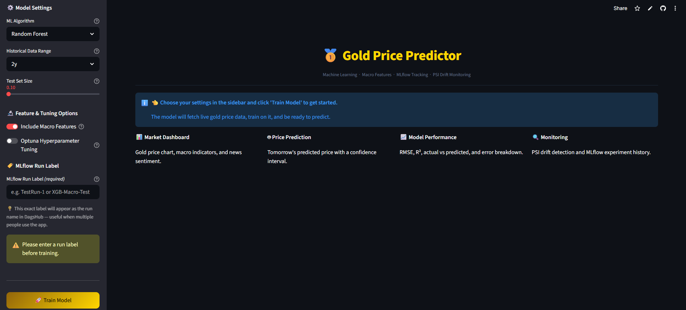

# 🥇 Gold Price Predictor



**[🔴 Live Demo](https://gold-price-prediction-rd.streamlit.app/)**

A machine learning web app that predicts gold prices using **Random Forest** and **XGBoost**, enriched with macroeconomic features, multi-step forecasting, SHAP explainability, Optuna hyperparameter tuning, PSI drift monitoring, and MLflow experiment tracking via DagsHub.

---

## What It Does

I built this to cover the full ML lifecycle — not just training a model, but monitoring it, tracking experiments over time, and explaining individual predictions. Gold price prediction made sense as a use case because it's driven by measurable macroeconomic factors I could pull for free.

The app has 5 tabs:

### 📊 Market Dashboard
Live gold price chart (line or candlestick) with selectable moving averages (20, 50, 200-day) and lookback periods up to 5 years. Five real-time macro indicator cards — USD Index (DXY), 10-Year Treasury Yield, Oil (WTI), S&P 500, and VIX — each showing the latest value and daily change. A news sentiment panel powered by VADER scores recent gold-related headlines from Yahoo Finance as supplementary context. Sentiment is not a model input — it gives background colour around the current prediction.

### 🤖 Price Prediction
Predicts tomorrow's gold closing price with a 95% confidence interval and a gauge chart. Below that, a multi-step recursive forecast (3, 5, or 7 trading days ahead) with a widening confidence band chart and a full forecast table showing predicted price, confidence range, and percentage change per day. Two SHAP charts explain exactly why the model made each prediction in dollar terms.

### 📈 Model Performance
Four metric cards — RMSE, MAE, R², and MAPE. An actual vs predicted price chart with an error panel below. An error distribution histogram and a scatter plot with a perfect-fit reference line.

### 🔍 Monitoring
PSI (Population Stability Index) and KS test drift detection across all features with a colour-coded bar chart. Prediction distribution and residual PSI checks. MLflow run history table with an RMSE trend chart across all past runs.

### 🎯 Optuna Trial History
Appears after training with Optuna enabled. Shows a podium with the top 3 trials (🥇🥈🥉) by RMSE, a convergence chart with the running best line, the best hyperparameters as metric cards, a full trial history table with medal rankings, and an RMSE distribution histogram.

---

## Tech Stack

| Layer | Tool |
|---|---|
| Gold price data | `yfinance` — GC=F (gold futures) |
| Macro indicators | `yfinance` — DXY, TNX, CL=F, GSPC, VIX |
| ML models | `scikit-learn` (Random Forest) + `XGBoost` |
| Hyperparameter tuning | `optuna` — TPE sampler, 10–50 trials |
| Explainability | `shap` — waterfall + summary charts |
| Drift monitoring | `scipy.stats` — custom PSI + KS implementation |
| Experiment tracking | `MLflow` — local or DagsHub remote |
| News sentiment | `vaderSentiment` + `yfinance` headlines |
| Visualisation | `Plotly` |
| Frontend | `Streamlit` |
| Hosting | Streamlit Community Cloud (free) |

I replaced Evidently AI with a custom PSI + KS implementation using scipy. PSI was originally developed for financial model monitoring in banking and credit risk — a much better fit for this use case than a generic observability tool.

---

## How the ML Model Works

```
Raw OHLCV data (GC=F gold futures — 1 to 5 years)
    + Macro data (DXY, TNX, CL=F, GSPC, VIX)
            │
            ▼
    Feature Engineering (19 base + 7 macro = 26 features)
    ├── Lag prices:      lag_1, lag_2, lag_3, lag_5, lag_10
    ├── Rolling stats:   7/20/50-day moving average + std dev
    ├── Momentum:        5-day change, 1-day and 5-day % returns
    ├── Intraday:        High-Low range, Open-Close gap
    ├── Calendar:        Day of week, month, year
    └── Macro:           DXY, 10Y yield, oil, S&P 500 return, VIX
            │
            ▼
    Chronological Train/Test Split (never random for time series)
            │
            ▼
    Optional: Optuna Tuning (10–50 trials, TPE sampler)
    Searches: n_estimators, max_depth, learning_rate,
              subsample, colsample_bytree, regularisation params
            │
            ▼
    Model Training — Random Forest or XGBoost
            │
            ▼
    Evaluation → RMSE, MAE, R², MAPE on test set
            │
            ├── MLflow logs params, metrics, run name, model artifact
            ├── SHAP explains each prediction in dollar terms
            └── PSI + KS monitors for data drift (train vs test)
```

---

## Understanding the Metrics

| Metric | What it means | Good value for gold |
|---|---|---|
| **RMSE** | Average prediction error in USD per oz | Lower is better |
| **MAE** | Similar to RMSE, less skewed by large errors | Lower is better |
| **R²** | How much price variance the model explains (0–1) | Close to 1.0 |
| **MAPE** | Error as a percentage of the actual price | Below 1% is excellent |

---

## Understanding SHAP

Feature importance shows which inputs matter globally. SHAP goes further — for each specific prediction it shows how much every feature pushed the price up or down in dollar terms:

```
Today's prediction: $2,847
  Yesterday's price   → +$38  (pushed UP)
  VIX fear index      → +$22  (pushed UP)
  USD index           → -$15  (pushed DOWN)
  10Y Treasury yield  → -$9   (pushed DOWN)
  Baseline (avg pred) →  $2,811
                      ─────────
  Total predicted     →  $2,847
```

---

## Understanding the Monitoring

### PSI — Population Stability Index

Compares the feature distributions the model was trained on against what it sees in the test period. Originally developed for financial model monitoring in banking.

| PSI | Status | Action |
|---|---|---|
| < 0.10 | 🟢 Stable | No action needed |
| 0.10 – 0.25 | 🟡 Monitor | Keep watching |
| ≥ 0.25 | 🔴 Retrain | Retrain recommended |

### KS Test — Kolmogorov-Smirnov

A statistical test checking whether two distributions are significantly different. A p-value below 0.05 means the difference is unlikely to be random noise.

---

## Understanding Multi-Step Forecasting

The app uses recursive forecasting — the model predicts Day 1, feeds that prediction back as input for Day 2, and so on up to 7 trading days. The confidence band widens each day using a √step multiplier. By Day 7 the band is intentionally wider than Day 1 — that is correct behaviour, not a bug.

---

## Understanding Optuna

Optuna searches for the best hyperparameters using a TPE sampler. Unlike grid search, it learns from each trial and focuses on the most promising parameter regions. A chronological validation split within the training data scores each trial — the test set is never touched during tuning.

---

## A Note on News Sentiment

The sentiment panel is display-only — it does not feed into the model. Yahoo Finance only provides the last few days of headlines, which isn't enough historical data to train on. It gives useful background context when interpreting a prediction but does not affect what the model outputs.

---

## MLflow Run Identification

The sidebar has a mandatory **MLflow Run Label** field that must be filled before training. Whatever you type becomes part of the run name:

```
TestRun-1__XGBoost__20260523_143022
```

This exact name appears in DagsHub / the local MLflow UI so you can find your specific run instantly — even when multiple people are using the app at the same time.

---

## Project Structure

```
gold-price-predictor/
│
├── app.py              ← Main Streamlit app — all 5 tabs and UI logic
├── data.py             ← Gold + macro data fetching and feature engineering
├── model.py            ← Model training, evaluation, multi-step forecast, prediction
├── monitoring.py       ← Custom PSI + KS drift monitoring
├── sentiment.py        ← VADER news sentiment via yfinance headlines
├── shap_utils.py       ← SHAP waterfall and summary chart data
├── mlflow_utils.py     ← MLflow experiment logging (local or DagsHub)
├── tuning.py           ← Optuna hyperparameter search for RF and XGBoost
├── train.py            ← Standalone training script (optional CLI use)
│
├── .github/
│   └── workflows/
│       └── retrain.yml ← GitHub Actions workflow (manual trigger only)
│
├── .streamlit/
│   └── secrets.toml    ← Credentials template (NOT committed to GitHub)
│
├── runtime.txt         ← Pins Python 3.11 for Streamlit Cloud
├── requirements.txt    ← All Python dependencies
├── .gitignore          ← Excludes mlruns/, secrets.toml, __pycache__, etc.
└── README.md           ← This file
```

---

## Running Locally

### 1. Clone the repo

```bash
git clone https://github.com/<your-username>/gold-price-predictor.git
cd gold-price-predictor
```

### 2. Create a virtual environment

```bash
python -m venv .venv

# macOS / Linux:
source .venv/bin/activate

# Windows:
.venv\Scripts\activate
```

### 3. Install dependencies

```bash
pip install -r requirements.txt
```

### 4. Run the app

```bash
streamlit run app.py
```

Opens at `http://localhost:8501`.

### 5. Browse MLflow runs locally

In a second terminal with the venv active:

```bash
mlflow ui
```

Open `http://localhost:5000` to see all training runs, compare metrics, and inspect artifacts.

---

## Deploying to Streamlit Community Cloud

1. Push your code to a **public GitHub repo**
2. Go to [share.streamlit.io](https://share.streamlit.io) and sign in with GitHub
3. Click **"Create app"** and fill in:
   - Repository: `your-username/gold-price-predictor`
   - Branch: `main`
   - Main file path: `app.py`
4. Click **"Deploy"** — Streamlit Cloud reads `requirements.txt` and installs everything automatically

---

## Optional: DagsHub Remote MLflow

By default MLflow logs to a local `mlruns/` folder which resets when Streamlit Cloud restarts. DagsHub gives you persistent tracking at no cost.

1. Create a free account at [dagshub.com](https://dagshub.com)
2. Connect your GitHub repo
3. Inside your DagsHub repo go to **Remote → Experiments** and copy the MLflow tracking URI
4. Get an access token from [dagshub.com/user/settings/tokens](https://dagshub.com/user/settings/tokens)
5. Go to Streamlit Cloud → **App Settings → Secrets** and add:

```toml
[mlflow]
dagshub_username = "your-dagshub-username"
dagshub_repo     = "gold-price-predictor"
dagshub_token    = "your-token-here"
```

---

## Ideas for Future Versions

- Multi-output forecasting — train a separate model per horizon instead of recursive chaining
- Hyperparameter comparison across runs — visualise how params changed between sessions
- Additional macro features — CPI release dates, Fed meeting dates as binary flags
- Scheduled auto-retraining — re-enable the GitHub Actions cron trigger when needed

---

## License

MIT — free to use, modify, and build on.
